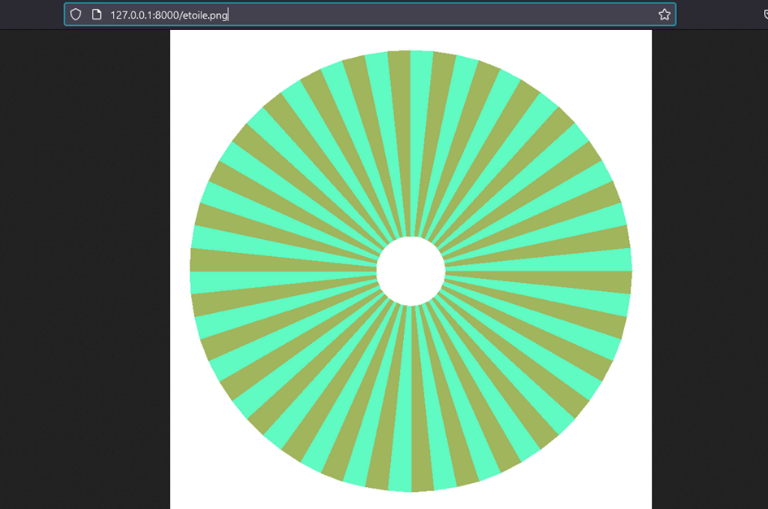
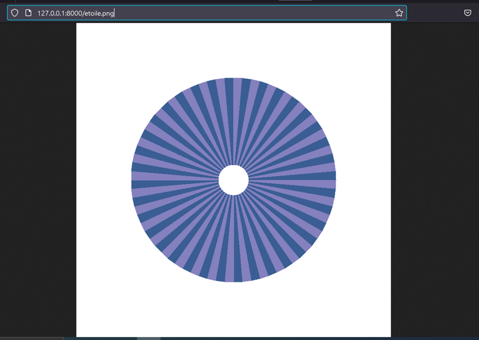

# SAE204partie2 – Génération d'une étoile de Siemens avec Python et Symfony

## Objectif du projet

L’objectif était de créer une étoile de Siemens à l’aide de Python (avec Pygame), puis de l’afficher dans un projet web Symfony. Le but final était de pouvoir voir le résultat dans un navigateur en accédant à une image générée dynamiquement.

---

## Étapes réalisées

### 1. Création du projet Symfony

J’ai commencé par créer un nouveau projet Symfony avec l’option web :

```bash
symfony new --webapp SAE204partie2
Ce projet m’a donné une base web avec un dossier public/, utile pour y mettre des fichiers accessibles via le navigateur.
2. Script Python avec Pygame

J’ai ensuite développé un script Python (mon_script.py) qui utilise la bibliothèque Pygame pour générer une étoile de Siemens.

J’y ai intégré :

    un système de couleurs aléatoires (mais assez contrastées),

    des rayons générés automatiquement,

    une fonction de dessin basée sur des calculs trigonométriques,

    et surtout, la sauvegarde de l’image dans public/ avec :

pygame.image.save(screen, "public/etoile.png")

3. Exécution du script

Pour que l’image soit accessible dans le navigateur, il faut d’abord exécuter le script Python :

python mon_script.py

Sinon, Symfony ne trouvera pas le fichier etoile.png.
4. Accès à l’image depuis le navigateur

Une fois le script lancé et l’image générée, je peux voir le résultat à cette adresse :

http://127.0.0.1:8000/etoile.png

Chaque fois que je relance le script, une nouvelle image est générée avec des paramètres différents (couleurs, taille, rayons...).

Structure du projet

SAE204partie2/
├── public/
│   └── etoile.png        <- Image générée automatiquement
├── mon_script.py         <- Script Python (Pygame)
├── ...

Conclusion

Ce projet m’a permis de :

    créer un script graphique avec Python,

    l’intégrer dans un projet Symfony pour l’afficher dans un navigateur,

    comprendre comment faire dialoguer Python et Symfony.

C’est un bon exercice pour relier back-end (génération de l’image) et front-end (affichage web).




